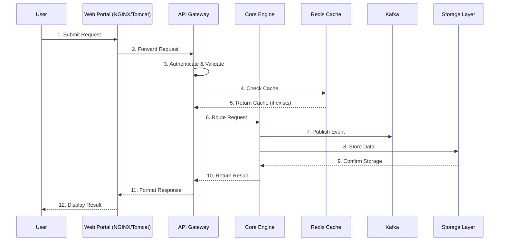
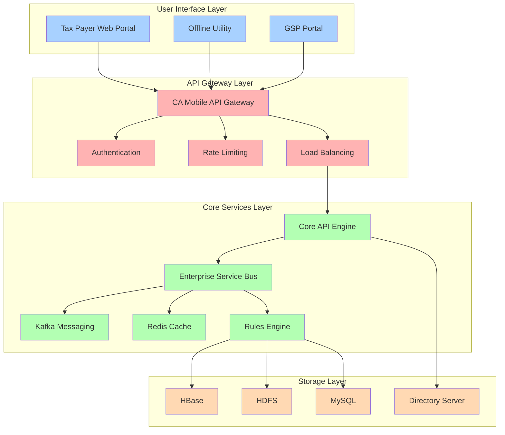
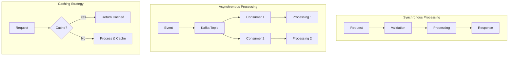
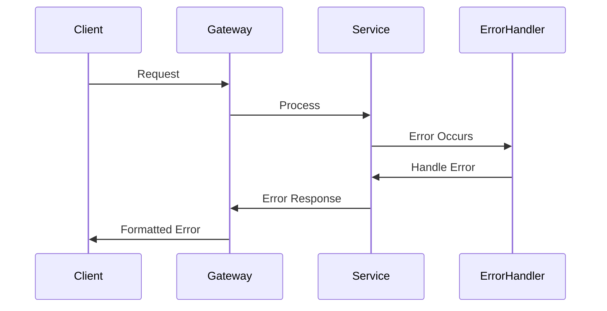

# Tax System Architecture Documentation

## Table of Contents

1. [System Overview](#system-overview)
2. [Architecture Layers](#architecture-layers)
3. [Component Details](#component-details)
4. [Data Flow](#data-flow)
5. [Interview Discussion Guide](#interview-discussion-guide)
6. [Technical Considerations](#technical-considerations)
7. [Diagrams](#diagrams)

[Previous sections remain unchanged until Interview Discussion Guide]

## Interview Discussion Guide

[Interview Q&A section remains unchanged]

## Technical Considerations

### Performance Optimization

- Edge caching
- Database indexing
- Connection pooling
- Lazy loading

### Security Implementation

- OAuth2/JWT authentication
- Role-based access control
- API rate limiting
- Data encryption

### Monitoring and Logging

- Centralized logging
- Performance metrics
- Real-time monitoring
- Alert systems

## Best Practices for Interview Discussion

1. **Start with High-Level Overview**

   - Explain the layered architecture
   - Highlight key components
   - Emphasize design patterns used

2. **Deep Dive into Specific Areas**

   - Discuss technology choices
   - Explain integration patterns
   - Detail security measures

3. **Highlight Scalability**

   - Discuss horizontal scaling
   - Explain caching strategy
   - Detail load balancing

4. **Address Challenges**
   - Discuss potential bottlenecks
   - Explain mitigation strategies
   - Share optimization techniques

## System Diagrams

### Architecture Diagram

Here's a simplified view of the architecture:

```
+------------------+     +---------------+     +------------------+
|   User Interface |     |  API Gateway  |     |   Core Services  |
|   (NGINX/Tomcat) | --> |  (CA Mobile)  | --> | (Microservices)  |
+------------------+     +---------------+     +------------------+
                                                       |
                                                       v
                                            +------------------+
                                            |  Storage Layer   |
                                            | (MySQL/HBase/etc)|
                                            +------------------+
```

### Data Flow Diagram

```
[User] -> [Web Portal] -> [API Gateway] -> [Core Services] -> [Storage]
   ^          |              |                  |               |
   |          v              v                  v               |
   +----------+-------------[Cache]------------[Queue]----------+
```

## Implementation Guidelines

### Development Best Practices

1. **Code Organization**

   - Follow microservices patterns
   - Implement clean architecture
   - Use dependency injection
   - Follow SOLID principles

2. **API Design**

   - RESTful API standards
   - API versioning
   - Proper error handling
   - Documentation (Swagger/OpenAPI)

3. **Testing Strategy**
   - Unit testing
   - Integration testing
   - Performance testing
   - Security testing

### Deployment Considerations

1. **Infrastructure**

   - Container orchestration (Kubernetes)
   - CI/CD pipelines
   - Infrastructure as Code
   - Environment management

2. **Monitoring Setup**

   - APM tools
   - Log aggregation
   - Metrics collection
   - Alerting systems

3. **Security Measures**
   - Regular security audits
   - Penetration testing
   - Compliance checks
   - Access control reviews

## Maintenance and Support

### Regular Maintenance

1. **System Updates**

   - Security patches
   - Version upgrades
   - Performance tuning
   - Capacity planning

2. **Backup Procedures**
   - Regular backups
   - Backup testing
   - Recovery drills
   - Data retention policies

### Support Procedures

1. **Incident Management**

   - Response procedures
   - Escalation matrix
   - Communication plans
   - Post-mortem analysis

2. **Documentation**
   - System documentation
   - API documentation
   - Runbooks
   - Knowledge base

## Future Considerations

### Scalability Planning

1. **Growth Strategies**

   - Capacity planning
   - Performance optimization
   - Resource allocation
   - Cost optimization

2. **Technology Evolution**
   - New technology adoption
   - Legacy system migration
   - Technical debt management
   - Innovation opportunities

### Business Continuity

1. **Disaster Recovery**

   - Recovery procedures
   - Backup systems
   - Failover testing
   - Business impact analysis

2. **Risk Management**
   - Risk assessment
   - Mitigation strategies
   - Compliance requirements
   - Security updates


# Tax System Architecture Documentation

[Previous sections remain unchanged until Data Flow section]

## Detailed Data Flow

### 1. Request Processing Flow



### 2. Detailed Flow Explanation

1. **Initial Request Processing**

   - User submits request through web portal
   - NGINX handles static content delivery
   - Tomcat processes dynamic requests
   - Load balancing occurs at web server level

2. **API Gateway Processing**

   - Request authentication and validation
   - JWT token verification
   - Rate limit checking
   - Request transformation if needed
   - Route determination based on service discovery

3. **Cache Layer Interaction**

   - Check Redis cache for existing data
   - Cache hit: Return cached response
   - Cache miss: Proceed to core services
   - Cache update on new data

4. **Core Service Processing**

   - Business logic application
   - Data validation rules
   - Transaction management
   - Event generation for async operations

5. **Asynchronous Processing**

   - Kafka receives events from core services
   - Events are published to relevant topics
   - Consumers process events asynchronously
   - Ensures system resilience and scalability

6. **Data Storage Operations**
   - Write operations to appropriate storage
   - Transaction management
   - Data replication if needed
   - Backup procedures

### 3. System Architecture



### 4. Data Processing Patterns



### 5. Error Handling Flow



[Previous Interview Q&A section remains unchanged]

[Rest of the sections remain unchanged]

